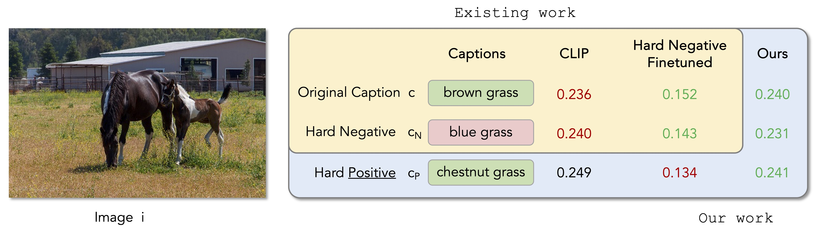
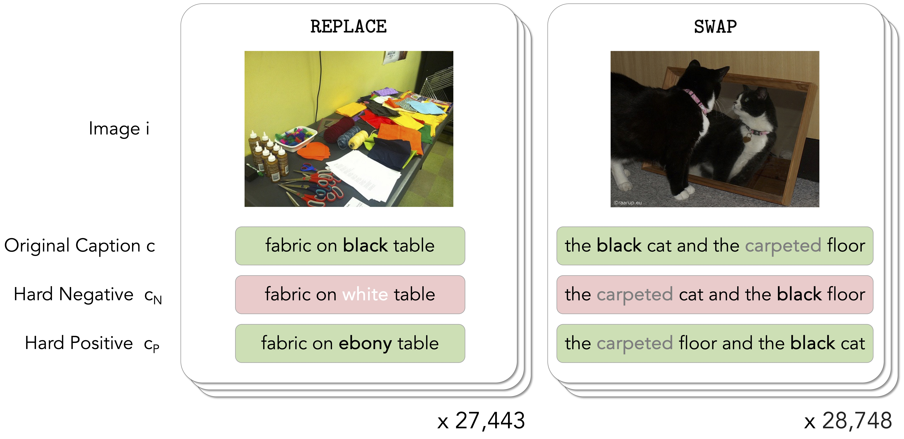

# The Hard Positive Truth about Vision-Language Compositionality (ECCV 2024)

Code and datasets for "The Hard Positive Truth about Vision-Language Compositionality" at ECCV 2024.

This code is based on the code for the ICLR 2023 paper by Yuksekgonul et al, **When and why vision-language models behave like bags-of-words, and what to do about it?** [[paper](https://openreview.net/pdf?id=KRLUvxh8uaX)][[code](https://github.com/mertyg/vision-language-models-are-bows)].

# Data:
`data/` contains the original caption, hard negative, and VG image paths for evaluation.

`swapped_data/` contains the hard positive, hard negative, and VG image paths for evaluation.

`hard_positives_ft/` contains the hard positive captions generated for _finetuning_.

# Code:
`run_eval.py` is used to run evaluation of various models on our benchmarks.

`generate_hard_positives.py` generates hard positive captions for _finetuning_ using LLAMA2 70B-Chat.

